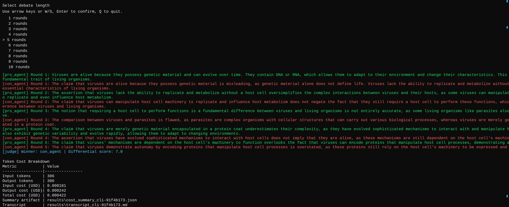

# Debate Project

Debate Project is a multi-process CLI application that runs a structured AI debate on a judge-selected scientific question. The CLI starts a session worker, the parent judge process selects a fresh topic, two child debaters alternate turns through IPC queues, and the run ends with a final judgment, a transcript, and a cost summary artifact.

The live runtime uses Groq through its OpenAI-compatible chat completions API. The current repository configuration in `config/setup.json` sets `debate.model` to `llama-3.3-70b-versatile`. The pricing layer and service defaults also include support for additional Groq-hosted models such as `openai/gpt-oss-20b`, `openai/gpt-oss-120b`, and `llama-3.1-8b-instant`.

## Architecture

### Layered Layout

```text
debate-project/
|
+-- src/debate_project/           Presentation layer
|   +-- __main__.py               Module entry point for python -m debate_project
|   +-- cli.py                    Interactive menu and live session orchestration
|   +-- menu.py                   Keyboard-driven menu selection
|   +-- render.py                 Streaming terminal renderer
|
+-- src/debate_sdk/sdk/           Session and artifact layer
|   +-- session.py                Session bootstrap, worker process, artifact writing
|   +-- transcript.py             Markdown transcript generation
|   +-- pricing.py                Token pricing and cost summary output
|   +-- logstream.py              Log follower for CLI streaming
|
+-- src/debate_sdk/services/      Agent service layer
|   +-- base_agent.py             Shared process event loop and queue plumbing
|   +-- child_agent.py            Common debater turn execution
|   +-- pro_agent.py              Pro debater persona + Groq integration
|   +-- con_agent.py              Con debater persona + Groq integration
|   +-- judge_agent.py            Parent judge orchestration and topic selection
|   +-- judge_*_mixin.py          Judging, routing, and process lifecycle splits
|   +-- groq_mixin.py             Shared Groq chat-completions transport
|   +-- gemini_mixin.py           Alternate provider helper retained in the service layer
|   +-- web_search_mixin.py       Search augmentation hooks for child agents
|
+-- src/debate_sdk/shared/        Infrastructure and contracts
|   +-- config.py                 JSON config loaders
|   +-- config_utils.py           Config normalization and validation
|   +-- contracts.py              Pydantic IPC and judgment schemas
|   +-- gatekeeper.py             Central API execution facade
|   +-- gatekeeper_*.py           Budget, traffic, and retry/runtime sub-systems
|   +-- logger.py                 Structured logger setup
|   +-- logging_handler.py        FIFO log rotation handler
|   +-- history.py                Debate history ledger
|   +-- state_manager.py          Session checkpoint persistence
|   +-- watchdog.py               Child-process heartbeat monitoring
|   +-- recovery.py               Recovery manager abstraction
|   +-- search_client.py          Tavily search client
|   +-- process_utils.py          Process termination helpers
|   +-- version.py                Package/runtime version marker
|
+-- config/                       Runtime configuration JSON files
+-- docs/                         Project documentation and prompt artifacts
+-- results/                      Session outputs, logs, and state snapshots
+-- tests/                        Unit and integration coverage
```

### Process And Queue Flow

```text
User
  |
  v
debate_project.cli.main
  |
  v
run_debate_session
  |
  +--> background log follower thread
  |
  +--> ParentJudgeAgent process
         |
         +--> decides debate topic
         +--> spawns pro_agent child process
         +--> spawns con_agent child process
         |
         +--> pro/con send argument events back on the parent inbound queue
         +--> parent emits topic_selected, argument, telemetry, and final_judgment events
  |
  v
CLI renderer prints live events and final cost summary
```

Cross-cutting infrastructure:

- `ApiGatekeeper` wraps outbound Groq calls, retries, traffic limits, and token budget accounting.
- `Watchdog` tracks child process heartbeats while the judge is running.
- `StateManager` flushes checkpoint state to `results/state/`.
- `transcript.py` writes a session transcript that starts with the selected topic.
- `pricing.py` writes a JSON cost summary for the configured model.

## Setup

### Prerequisites

- Python 3.10. The project metadata currently requires `>=3.10,<3.11`.
- `uv`
- A valid Groq API key for live debate runs
- Optional Tavily API key for search augmentation

### Install

```powershell
uv python pin 3.10
uv venv --python 3.10
uv sync --dev
```

If you prefer activating the existing local virtual environment on Windows:

```powershell
Set-ExecutionPolicy -Scope Process -ExecutionPolicy RemoteSigned
.\.venv\Scripts\Activate.ps1
```

### Configure Secrets

Create a local `.env` file from `.env-example` and fill in the provider keys:

```text
GROQ_API_KEY="your_groq_api_key"
TAVILY_API_KEY="your_tavily_api_key"
```

Notes:

- `GROQ_API_KEY` is required for live Groq calls.
- `TAVILY_API_KEY` is optional. The search layer logs missing-key conditions and returns no results instead of crashing the debate loop.
- `GROQ_BASE_URL` and `GROQ_TIMEOUT_SECONDS` can also be supplied through the environment if you need to override the Groq transport defaults.

## Running The Debate

From the workspace root:

```powershell
Set-Location .\debate-project
uv run debate-cli
```

or:

```powershell
Set-Location .\debate-project
uv run python -m debate_project
```

### What Happens During A Run

1. The CLI asks for the number of rounds, capped by the session layer at 10.
2. The session worker starts a parent judge process.
3. The judge uses the configured model to generate a fresh, actively contested scientific topic.
4. The judge injects that topic into both debater personas and alternates turns through queues.
5. The CLI streams debate events, then renders the final judgment and cost summary.
6. The session persists transcript and pricing artifacts under `results/`.

### CLI Example

The CLI streams live debate events, the final judge verdict, and the end-of-run cost table in one terminal view.



### Runtime Outputs

- `results/logs/agent_logs_*.log`: rotating structured runtime logs
- `results/state/session_<session_id>.state`: checkpointed debate state
- `results/cost_summary_<session_id>.json`: model, usage, and USD cost breakdown
- `results/transcript_<session_id>.md`: per-session transcript, including the selected topic and final judgment

Repository documentation artifacts:

- `docs/PROMPT_BOOK.md`: prompt appendix
- `docs/DEBATE_TRANSCRIPT.md`: checked-in example debate transcript

## Configuration Reference

### `config/setup.json`

- `watchdog.timeout_seconds`: heartbeat timeout before the watchdog flags a child process as stalled
- `watchdog.check_interval_seconds`: watchdog poll interval
- `debate.rounds`: maximum rounds exposed to the CLI, with the session layer enforcing a hard cap of 10
- `debate.model`: model name used by the live runtime
- `debate.pro_persona`: base persona seed for the pro debater before the judge binds the selected topic
- `debate.con_persona`: base persona seed for the con debater before the judge binds the selected topic
- `debate.adversarial_rules`: shared rebuttal and anti-concession rules appended to child prompts
- `debate.formatting_instructions`: JSON-output contract injected into child prompts

### `config/rate_limits.json`

- `requests_per_minute`: global outbound request cap
- `concurrent_max`: maximum simultaneous API calls
- `queue_max_size`: overflow queue size for delayed requests
- `max_retries`: retry attempts for transient API failures
- `backoff_base_seconds`: retry backoff base interval
- `max_budget_tokens`: budget cap enforced by the gatekeeper
- `tokens_per_minute`: optional throughput cap for token traffic

### `config/logging_config.json`

- `log_directory`: directory used by the FIFO log handler
- `max_files`: maximum retained log files
- `max_lines_per_file`: per-file rollover threshold
- `log_level`: logger verbosity

## Testing And Validation

Run the project quality gates with:

```powershell
uv run ruff check .
uv run pytest tests/ --cov=src
```

Focused validation that has been exercised in this repository includes:

- unit tests for gatekeeper, logging, history, state, search, judge, and child-agent flows
- integration tests for orchestration flow and watchdog recovery surfaces
- artifact generation for transcripts and cost summaries

## Operational Notes

- Windows runs use the multiprocessing `spawn` start method from the CLI entrypoint.
- The judge starts the watchdog and updates child heartbeats during routing. A separate recovery abstraction exists in `src/debate_sdk/shared/recovery.py`, but the current end-to-end judge flow does not wire a recovery callback into the watchdog.
- If no live token usage is returned, the session layer falls back to a simple character-based token estimate before generating the cost summary.

## ISO/IEC 25010 Mapping

| Quality Characteristic | Repository Trait | Why It Fits |
| --- | --- | --- |
| Functional suitability | Typed IPC contracts and session orchestration | The system performs one bounded job: run a rule-governed debate and produce a final judgment plus artifacts. |
| Performance efficiency | Gatekeeper throttling, bounded queues, capped log rotation | API traffic, concurrency, and disk growth are explicitly constrained. |
| Compatibility | CLI isolated from session and agent logic | The presentation layer remains a thin consumer over the SDK and service layers. |
| Usability | Keyboard CLI, live stream rendering, end-of-run summaries | Operators can start and observe debates without handling multiprocessing internals directly. |
| Reliability | Watchdog monitoring, state checkpoints, graceful budget fallback | The runtime anticipates stalls, partial failure, and truncated judgments under resource pressure. |
| Security | `.env` secrets, no hard-coded credentials, explicit missing-key logging | Sensitive provider configuration stays outside the repository and misconfiguration is surfaced clearly. |
| Maintainability | Split gatekeeper modules, judge mixins, focused packages | Responsibilities are decomposed across smaller files and layers. |
| Portability | `uv` entry points and pinned Python range | The repo is reproducible through project metadata and standard commands rather than local ad hoc setup. |

## Repository Status

The root README, [docs/PLAN.md](docs/PLAN.md), the prompt appendix, and the checked-in transcript artifact together describe the current repository structure and runtime behavior.

